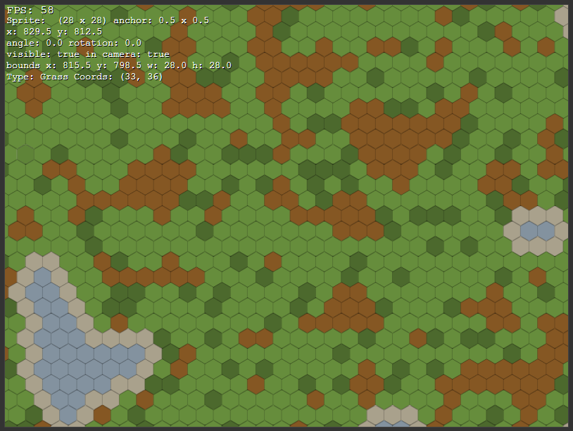

# Hex World

This is a little side project I've been playing with.

Right now, it's just a randomly generated hex grid using a modified 'Game of Life' simulation to create the map.

The plan is to create a game where you must survive with the available resources.

Very little planning has gone into this, as the initial desire was really just to make the world generator.

The zoomed-in map currently looks something like this:

